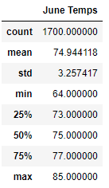
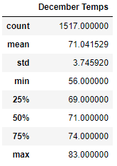

# Surf's Up

## Overview of the Surf's Up Analysis
An investor wants to learn about the weather in Oahu, Hawaii, before committing to any investments in our Surf & Ice Cream shop venture. The investor's main concern is the temperature, and percipitation in the area will cause the shop to close too frequently.

## Resources
- Data Source: hawaii.sqlite
- Software: Python 3.9.6, Conda 4.10.3, SQLite 3.35.4

## Analysis Results
- In our data of the area we can see that for the month of June; the average temperature was 74.9°, and the lowest and highest temperatures reaching 64° and 85° respectively.

- For the month of December; the average temperature was 71.0°, and the lowest and highest temperatures reaching 56° and 83° respectively.

- The standard deviation in the area's temperature in the month of June is 3.26, and increases to 3.75 in the month of December.

## Summary
Our data results should alleviate part of our potential investor's concerns. We can see that average temperature remains reasonable accross both seasons. And the increase of 0.49 in the standard deviation shows that there is only a slight difference in temperature volatility accross both seasons. We should perform additional queries to gather information about the area's precipitation levels, since that is another major factor in determining the suitability of the area. Additionally it may be beneficial to query more months out of the year to ensure our dataset is not too small, and is not skewed due to some outliers in the months of June or December.